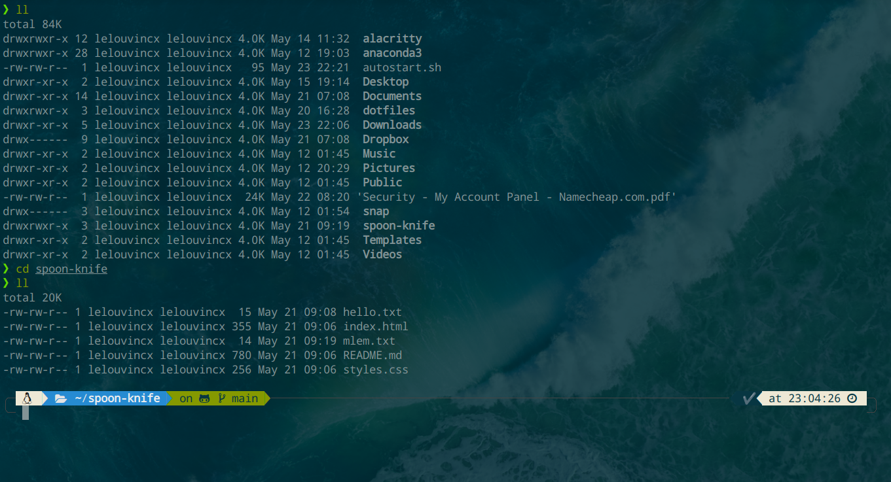
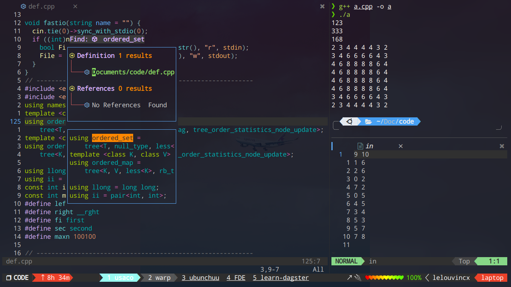
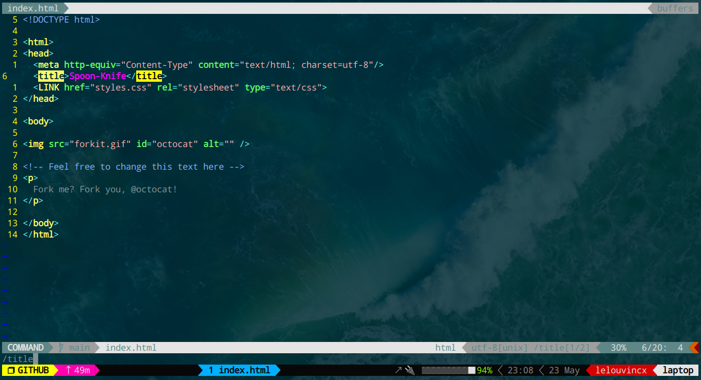
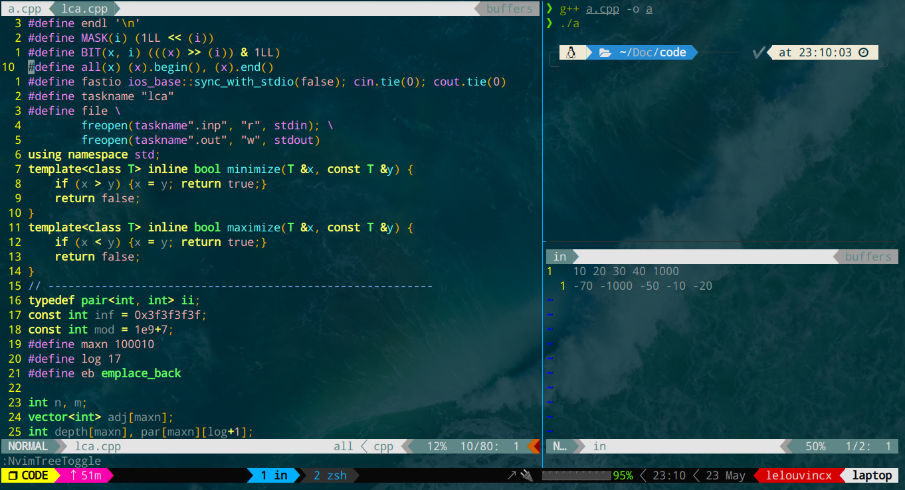

# Lelouvincx's dotfiles
My dotfiles configuration with alacritty, zsh, tmux and neovim.

**Warning**: Don't blindly copy my settings and use directly in your system without knowing details. You should clone this repo and give it a try before applying to your system. Use at your own risk!

## Contents
- Alacritty
- Zsh
- Tmux
- Neovim

## Alacritty
No need installing extensions but you need a [config file](./alacritty.yml).

Font I used: DroidSansMono Nerd Font (supports icons). [More info](https://github.com/ryanoasis/nerd-fonts).

## Zsh
Version: 5.8.1 or higher.

- [Oh-my-zsh](https://github.com/ohmyzsh/ohmyzsh): a framework for zsh plugin management and configuration
- [Autosuggestions](https://github.com/zsh-users/zsh-autosuggestions): autosuggestions for zsh
- [Syntax highlighting](https://github.com/zsh-users/zsh-syntax-highlighting): highlights suggested command
- [Powerlevel10k](https://github.com/romkatv/powerlevel10k): an out-of-the-box experienced theme for zsh
- [The Fuck](https://github.com/nvbn/thefuck): an error correction for console commands
- [Command-not-found](https://github.com/Tarrasch/zsh-command-not-found): provides suggested packages to be installed

For more zsh plugins, [visit here](https://github.com/unixorn/awesome-zsh-plugins).

## Tmux
Version: 3.2a or higher.

I customized from [.tmux](https://github.com/gpakosz/.tmux), you can separately clone this repo and use it for your own.

## Neovim
Version: 0.7.0 or higher.

- [Vim-plug](https://github.com/junegunn/vim-plug): a minimalist vim plugin manager
- [NeoSolarized](https://github.com/overcache/NeoSolarized): color scheme
- [nvim-web-devicons](https://github.com/kyazdani42/nvim-web-devicons): efficient icons for dev
- [vim-tmux-navigator](https://github.com/christoomey/vim-tmux-navigator): to navigate smoothly between neovim and tmux panes
- [vim-airline](https://github.com/vim-airline/vim-airline) and [theme](https://github.com/vim-airline/vim-airline-themes): beautiful customizable status line
- [vim-commentary](https://github.com/tpope/vim-commentary): toggle comment and uncomment for code
- [auto-pairs](https://github.com/jiangmiao/auto-pairs): insert or delete brackets, parens, quotes in pair
- [nvim-tree](https://github.com/kyazdani42/nvim-tree.lua): a file explorer shown as tree
- [tagbar](https://github.com/preservim/tagbar): an easy way to get an overview of code's structure
- [SimpylFold](https://github.com/tmhedberg/simpylfold): Simple fold to get an easier view
- [tree-sitter](https://github.com/tree-sitter/tree-sitter): code and syntax highlighting support multiple languages
- [vim-fugitive](https://github.com/tpope/vim-fugitive): a git plugin for vim
- [nvim-lspconfig](https://github.com/neovim/nvim-lspconfig): a collection of configs for neovim's built-in LSP
- [coc-nvim](https://github.com/neoclide/coc.nvim): an extension host, loads extensions like vscode ans host language servers
- [ranger](https://github.com/francoiscabrol/ranger.vim) and [bclose](https://github.com/rbgrouleff/bclose.vim): a console file manager
- [FZF](https://github.com/junegunn/fzf): a command-line fuzzy finder for neovim
- [vim-startify](https://github.com/mhinz/vim-startify): a fancy start screen for vim

## Requirements

### Alacritty
Read the fully installation [here](https://github.com/alacritty/alacritty/blob/master/INSTALL.md) for more.

### Zsh and oh-my-zsh
Install zsh and oh-my-zsh plugin manager.
```bash
sudo apt-get install zsh -y
sudo curl -L http://install.ohmyz.sh | sh
git clone git://github.com/zsh-users/zsh-autosuggestions ~/.oh-my-zsh/custom/plugins/zsh-autosuggestions
git clone https://github.com/zsh-users/zsh-syntax-highlighting.git
```

Set it as the default shell
```bash
sudo chsh -s $(which zsh)
```

### Tmux
Install tmux
```bash
sudo apt-get install tmux
```

### Neovim
Download the releases and install the latest version of neovim [here](https://github.com/neovim/neovim/releases/tag/v0.7.0).

#### Ruby
```bash
sudo apt-get install ruby-full
```

#### Nodejs
```bash
sudo apt-get install nodejs
sudo apt-get install npm
```

#### Neovim package on python3, nodejs, ruby
```bash
sudo apt-get install python3-pip # If pip's not on your system
pip install neovim
pip install pynvim

sudo npm install -g neovim

gem install neovim
```

#### Neovim package on python2
```bash
curl https://bootstrap.pypa.io/pip/2.7/get-pip.py --output get-pip.py # To download get-pip.py
sudo python2 get-pip.py
pip2 --version # Check the pip2's version

pip2 install neovim
pip2 install pynvim
```

For more dependencies, you can open neovim and run `:checkhealth` to know which packages need installing.

## Usage

Please make sure you know and understand how your configs work before continuing. Since this is just my personal working configurations, I don't provide any user support. Just look at it as a valuable references for your own configurations. If you run into any issues, you can try:
1. Google and stackoverflow the error message
2. Check your dependencies and environments
3. Report with the plugin author

If you want to experience with this dotfiles it's pretty easy to do. Firstly you should backup all your config files in one place to keep it safe. Then fork this repo and clone to your local system and play with it anyway you want.

- Resource alacritty config by saving the `alacritty.yml` file.
- Resource zsh config by `zsh ~/.zshrc` or relaunch the terminal.
- Resource tmux by `tmux source ~/.tmux.conf`. And you can install extensions by pressing `Ctrl + b + I` (in this case prefix key is Ctrl + b).
- Resource neovim config by saving then `:so%`. Or you can relaunch it.

Many thanks for reading until here and enjoy your own dotfiles!

## Thanks to...
I want to give the special thanks to Ly Thanh Nhan, who first inspired me to use neovim as main IDE. After a pretty long time working on this project I think myself has a good knowledge and experience to share you guys. Besides, [balldk](https://github.com/balldk), [craftzdog](https://github.com/craftzdog/dotfiles-public) and [drievints](https://github.com/driesvints/dotfiles) taught me a lot for completing and improving my configs.

In general, I want to give thanks to everyone who shares their dotfiles for their efforts to contribute their knowledge, mind and experience to the open-source community.

## About me
- Visit my blog: [redmapleleaf.me](https://redmapleleaf.me/)
- Email me: dinhminhchinh3357@duck.com
